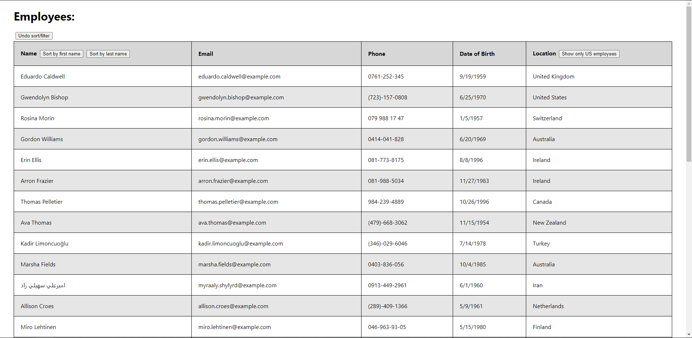

# Homework 19: Employee Directory

## Screenshot

## Deployed to

https://gsonnier333.github.io/employee-directory/

## Description

For this assignment, I was instructed to create a React app that can display an employee directory for a business in the form of a table. I used the "random user" api to populate the table with "employees" for the purposes of showing the app in action. For each employee, the user can see their full name, email, phone number, date of birth, and the country in which they are located. The table lists the employees (of which there are currently 30) in the order the api gives it, but using the buttons along the top, the employees can be resorted in alphabetical order based on either their first or last names. There's also a button along the top of the table that allows the user to filter the employees down to only those that work in the US. If the user wishes to see the original unsorted/unfiltered list again, there is likewise another button to revert the list to its original state.

This assignment was a great introduction into creating and deploying a React app using some of React's core features. It gave me practice creating components, building pages, and manipulating state to add functionality to a page made in React. The hardest part was getting used to React's syntax and some of the quirks it has when using state on a page for functionality, but after working through this assignment I feel much more comfortable with the basics of the library.
